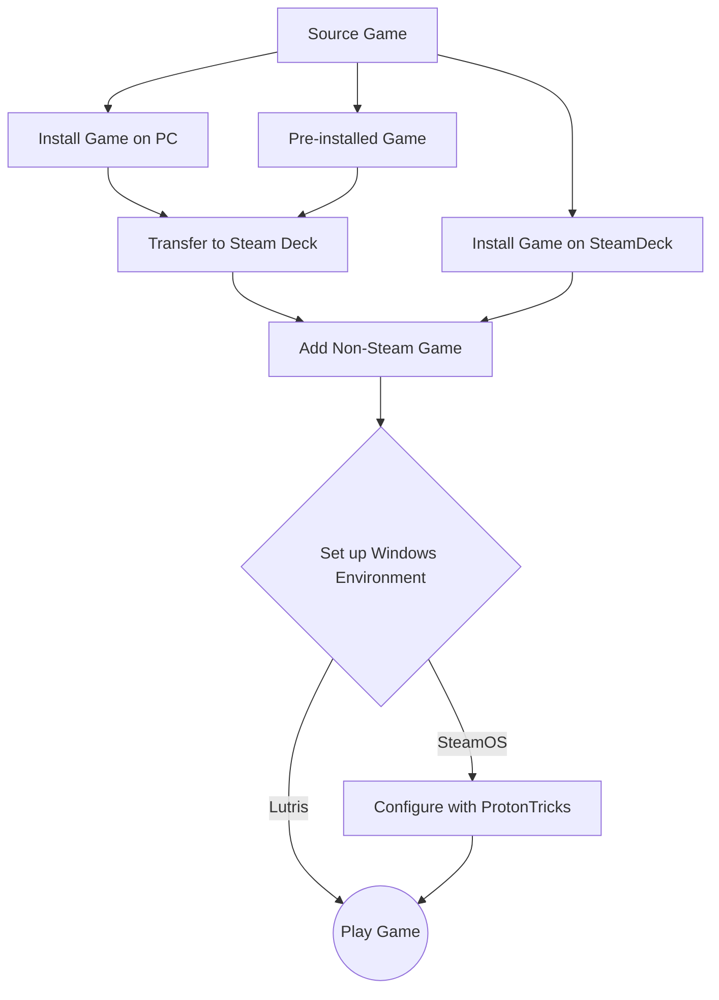

# Guides for installing games

```mermaid
graph TD
    A[Source Game]
    B["Install Game on PC"]
    C["Pre-installed Game"]
    D["Install Game on SteamDeck"]
    E["Transfer to Steam Deck"]
    F["Add Non-Steam Game"]
    G{"Set up Windows Environment"}
    H["Configure with ProtonTricks"]
    Z((Play Game))

    A --> B
    A --> C
    A --> D
    B --> E
    C --> E
    E --> F
    D --> F
    F --> G
    G -- SteamOS --> H
    G -- Lutris --> Z
    H --> Z
```
